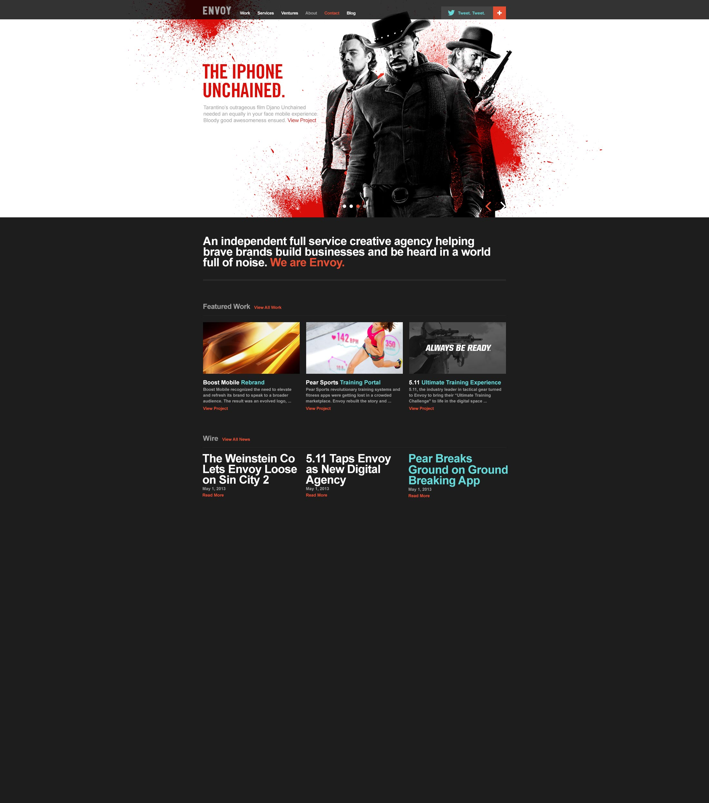
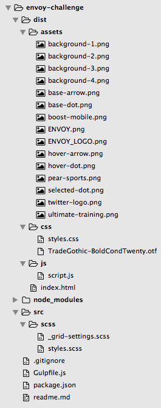

# ENVOY Coding Challenge


Envoy asked me to translate to html the following psd. 



The directions state that we must use Gulp, bourbon and neat, so the first thing is creating the right dev environment for these technologies.

### Creating the developing environment

Here is the list of libraries and frameworks we will be including:

1. npm
2. Gulp
3. Browsersync
4. Gulp Sass
5. Bourbon
6. Neat

I previously had installed npm and gulp on my computer but if not, you will need to install that software beforehand.

I created a local folder to host the project called envoy-challenge.

First things first, I initialized a git repo by running git init from inside this folder and made the initial commit. Next, I logged in to my github account and created the remote repository with the same name and added as origin to the local repo.  For now on, after each commit, I push every commit online to keep a saved version of the project on my Github.

Let's start installing the tech we will need on our local repo.

##### NPM

We start by running on the terminal

```bash
$ npm init
```

 inside the folder to create the package.json file, during this process you will be ask several questions, you don't have to provided those anwsers now. 

##### Gulp

Gulp is next, this will automate tasks like compiling our SASS to CSS code so browser can interpret the stylesheets.

```bash
$ npm install gulp --save-dev
```

Next is to create the Gulpfile.js file, we will add here the tasks to be automatize, define gulp and start writting the tasks.

to make sure that everything worked as intended run from the terminal:

```bash
$ gulp
```

##### SASS

Next we need to install SASS, define it in our gulpfile.js and add the task.

```bash
$ npm install gulp-sass --save-dev
```

##### Bourbon & Neat

Finally we install bourbon and neat to the project, define them on gulpfile.js and create the tasks.

```bash
$ npm install node-bourbon --save-dev
$ npm install node-neat --save-dev
```

##### BrowserSync

Lastly we add BrowserSync.

```bash
$ npm install browser-sync --save-dev
```

BrowserSync allows us to automaticlly render the html file on your browser without reloading the page.

For that we need to writte the tasks to automatize the process, so we need just to design the page.

Gulpfile.js will look like this:

```javascript
"use strict"

var gulp = require("gulp");
var sass = require("gulp-sass");
var bourbon = require("node-bourbon").includePaths;
var neat = require("node-neat").includePaths;
var browserSync = require("browser-sync");

//Compiles all gulp tasks
gulp.task('default', ['sass']);

// Live reload anytime a file changes
gulp.task("watch", ["browserSync", "sass"], function() {
  gulp.watch("src/scss/**/*.scss", ["sass"]);
  gulp.watch("dist/*.html").on("change", browserSync.reload);
});

// Spin up a server
gulp.task("browserSync", function() {
  browserSync({
    server: {
      baseDir: "dist"
    }
  })
});

// Compile SASS files
gulp.task("sass", function() {
  gulp.src("src/scss/**/*.scss")
      .pipe(sass({
        includePaths: bourbon,
        includePaths: neat
      }))
      .pipe(gulp.dest("dist/css"))
      .pipe(browserSync.reload({
        stream: true
      }))
});
```

Once we have all the libraries and frameworks installed, we need to scaffolder our project, we will make sure that the file structure is aligned with what we have defined on our gulpfile.js

This is how my project is structured:



Lastly, don't forget to import the libraries to styles.scss:

```scss
@import "bourbon";
@import "grid-settings";
@import "neat";
```

Create the index.html rule and you are ready to go.

The rest is just codding, y proces is:

1. Define the structure of the website in html adding all the elements.
2. Give style to the elements with SCSS, in this case using Bourbon and its grid Neat.
3. Write the interactions with JavaScript or SCSS animations/transitions...


If you have any questions don't hesitate in reaching out to me.

## Thank you for visiting.

